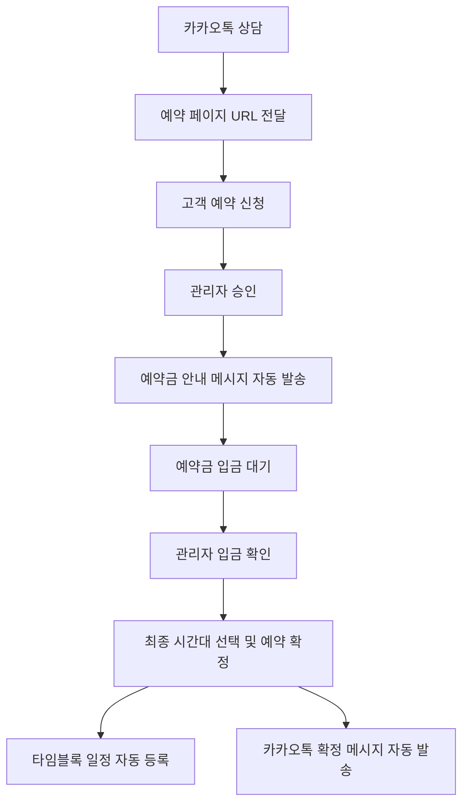

# PreBook - 뷰티샵 예약 자동화 시스템

# TODO(25/03/15)
- 카카오 비즈를 받아야 카카오dev랑 연결이 가능해서, 비즈 받기전에는 채널 자동응답메시지 구현 불가
- Timeblocks 연동 진행중 -> 추가 테스트 필요
- 또한 kimuu의 selling point 중 하나인 '정성스러운 상담'이 시장에 얼마나 영향을 끼칠지 계속 논의해봐야함. '정성스러운 상담'이 체계적인 예약과 함께 병행될수도 있다는 점은 기억할것. 흑백논리로 생각하진 말자

## 1. 프로젝트 개요
### 1.1 개발 배경
- 원장님께서 카카오톡으로 예약 상담 후 수기로 타임블록 캘린더에 일정을 입력하는 프로세스
- 수동 입력 과정에서 발생하는 human error와 반복 작업의 비효율 존재
- 자동화를 통한 업무 효율 개선 필요

### 1.2 목표
- 예약 프로세스 자동화를 통한 업무 효율성 향상
- 예약 정보의 정확성 확보
- 원장님의 수동 작업 최소화
- 고객 편의성 향상을 위한 통합 예약 시스템 제공

## 2. 예약 프로세스
### 2.1 전체 Flow


### 2.2 예약 상태
```typescript
type ReservationStatus = 
  | 'pending'           // 신청됨
  | 'deposit_wait'      // 승인됨 & 예약금 대기중
  | 'deposit_confirmed' // 예약금 확인됨
  | 'confirmed'         // 예약 확정
  | 'rejected'          // 거절됨
```

<br>

## 3. 시스템 아키텍처
### 3.1 기술 스택

- Frontend: Next.js, TypeScript, Tailwind CSS, shadcn/ui
- Database: Supabase
- Storage: Supabase Storage
- 자동화: Puppeteer (타임블록 웹 자동화)
- API: 카카오톡 비즈니스 채널 API (개발 중단 상태)

### 3.2 데이터베이스 구조
```typescript
// 시술 타입 정의
enum serviceTypes {
  natural = 'natural',      // 자연눈썹
  combo = 'combo',          // 콤보눈썹
  shadow = 'shadow',        // 섀도우눈썹
  retouch = 'retouch',      // 리터치
  brownline = 'brownline',  // 브라운아이라인
  removal = 'removal',      // 잔흔제거
  recommend = 'recommend'   // 키뮤원장 추천시술
}

interface ServiceInfo {
  name: string;
  duration: 1 | 2;  // 시술 소요시간 (시간 단위)
}

interface DesiredTimeSlot {
  date: string;
  time: string;
  priority: 1 | 2 | 3;  // 우선순위
}

interface Reservation {
    id: string;
    customer_name: string;
    gender: string;
    age: number;
    phone: string;
    desired_service: keyof typeof serviceTypes;
    referral_source: string | null;
    desired_slots: DesiredTimeSlot[];    // 희망 시간대
    confirmed_slot?: {                   // 확정된 시간대
      date: string;
      time: string;
    };
    prior_experience: string | null;
    front_photo_url: string | null;
    closed_photo_url: string | null;
    status: ReservationStatus;
    deposit_confirmed_at?: Date;
    status_updated_at: Date;
    created_at: Date;
    updated_at: Date;
}
```

<br>

## 4. 주요 기능
### 4.1 예약 신청 페이지 (/prebook)

- 고객 정보 입력

    - 기본 정보 (이름, 성별, 나이, 연락처)
    - 시술 정보 (희망 시술 선택, 시술 경험)
    - 사진 첨부 (눈썹 사진 2장)


- 시술 선택 기능

    - 카테고리별 시술 분류 (눈썹문신/기타시술)
    - 시술별 상세 설명 제공
    - 버튼 형식의 직관적인 UI


- 통합 예약 캘린더
    
    - 예약 가능한 날짜/시간대 표시
    - 시술 소요시간에 따른 예약 가능 시간 자동 조정
    - 1~3순위 시간대 선택 기능
    - 오전/오후 시간대 구분 표시


### 4.2 관리자 대시보드 (/admin/dashboard)

- 예약 목록 조회 및 필터링
- 예약 상세 정보 확인
- 예약 상태 관리
    - 승인/거절
    - 예약금 확인
    - 최종 시간대 선택
- 예약 확정


- 자동화 기능 연동
    - 카카오톡 메시지 발송
    - 타임블록 일정 등록

- 시인성 개선된 상태 표시 시스템


### 4.3 자동화 기능

- (1차)승인 -> 예약 승인 시:
   - 카카오톡 예약금 안내 메시지 발송 (비즈채널 전환 필요로 잠정 중단)
- (2차)승인 -> 예약 확정 시:
   - 선택된 시간대로 타임블록 자동 등록
   - 카카오톡 예약 확정 메시지 발송 (비즈채널 전환 필요로 잠정 중단)

<br>

## 5. 구현 현황
### 5.1 완료된 기능
✅ 프로젝트 초기 설정<br>
✅ 기본 예약 신청 페이지 구현<br>
✅ 관리자 대시보드 기본 구현<br>
✅ Supabase 연동<br>
✅ 파일 업로드 기능<br>
✅ 예약 승인/거절 기능<br>
✅ 통합 예약 캘린더 구현<br>
✅ 시술 선택 UI 개선<br>
✅ 예약 상태 관리 확장<br>
✅ 시술 소요시간 기반 예약 시스템 구현<br>
✅ 예약 상태 표시 시인성 개선<br>
✅ 타임블록 자동화 구현<br>
### 5.2 진행 중인 기능
⬜ 카카오톡 메시지 자동화(비즈니스 채널 전환 필요로 보류 중)<br>
⬜ 관리자 인증 구현<br>
### 5.3 예정된 기능
⬜ 카카오톡 API 연동 (대체 방안 모색 중)<br>
⬜ 입금 확인 자동화<br>
## 6. 자동화 기능 사용 방법
### 6.1 타임블록 자동화 설정

- 필요한 패키지 설치

```bash
npm install puppeteer
```

- API 라우트 구현
```typescript
// src/app/api/timeblock/route.ts
import { NextResponse } from 'next/server';
import { timeblockAutomation } from '@/lib/automation/timeblock';

export async function POST(request: Request) {
  try {
    const body = await request.json();
    const { customerName, date, time, isRetouching } = body;
    
    await timeblockAutomation.addEvent({
      customerName,
      date,
      time,
      isRetouching
    });
    
    return NextResponse.json({ success: true });
  } catch (error) {
    return NextResponse.json(
      { success: false, error: (error as Error).message },
      { status: 500 }
    );
  }
}
```

- 자동화 클래스 구현

```typescript
// lib/automation/timeblock.ts
import puppeteer from 'puppeteer';

interface TimeblockEvent {
  customerName: string;
  date: string;
  time: string;
  isRetouching: boolean;
}

// 대기를 위한 delay 함수
const delay = (ms: number) => new Promise(resolve => setTimeout(resolve, ms));

export class TimeblockAutomation {
  private email: string = "email@example.com"; // 실제 이메일로 변경
  private password: string = "password"; // 실제 비밀번호로 변경

  async addEvent(event: TimeblockEvent) {
    const browser = await puppeteer.launch({ headless: false });
    try {
      const page = await browser.newPage();
      
      // 타임블록 사이트 접속 및 로그인 로직
      // ...
      
      // 페이지 컨텍스트 내에서 직접 날짜 요소를 찾고 클릭
      const dateFound = await page.evaluate((targetDay) => {
        const elements = document.querySelectorAll('.css-10sf0gr-DateCellLayer__Layer > div');
        for (let i = 0; i < elements.length; i++) {
          const element = elements[i];
          const text = element.textContent ? element.textContent.trim() : '';
          if (text === targetDay || text.includes(targetDay)) {
            (element as HTMLElement).click();
            return true;
          }
        }
        return false;
      }, day);
      
      // 일정 입력 및 저장 로직
      // ...
      
      return true;
    } catch (error) {
      throw error;
    } finally {
      await browser.close();
    }
  }
}

export const timeblockAutomation = new TimeblockAutomation();
```

### 6.2 API 라우트

- 타임블록 자동화: /api/timeblock

- POST 요청으로 호출
- 고객명, 날짜, 시간, 시술 정보를 전달

## 7. 향후 개선 사항

- 입금 확인 자동화 (은행 API 연동)
- 예약 통계 및 분석 기능
- 고객 관리 시스템 통합
- 매출 관리 연동
- 카카오톡 API 연동 (비즈니스 채널 문제 해결 후)

## 8. 코드 구조 및 주요 파일

- src/app/prebook/page.tsx: 예약 신청 페이지
- src/app/admin/dashboard/page.tsx: 관리자 대시보드
- src/components/calendar/Calendar.tsx: 예약 캘린더 컴포넌트
- src/lib/automation/timeblock.ts: 타임블록 자동화 로직
- src/app/api/timeblock/route.ts: 타임블록 API 라우트
- src/constants/messageTemplates.ts: 메시지 템플릿

## 9. 주의사항

- 타임블록 자동화 사용 시 로직에 변경이 필요할 수 있음
- 타임블록 웹사이트 UI가 변경될 경우 셀렉터 업데이트 필요
- 카카오톡 메시지 관련 코드는 비즈니스 채널 연동 전까지 주석 처리 권장
- 메시지 템플릿 변경 시 messageTemplates.ts 파일 수정 필요
<br>

이 프로젝트는 단순한 예약 시스템을 넘어, 뷰티샵 운영의 효율성을 높이는 것을 목표로 합니다. 현재는 예약 프로세스 자동화에 집중하고 있으며, 추후 더 많은 운영 관리 기능을 추가할 수 있습니다.
